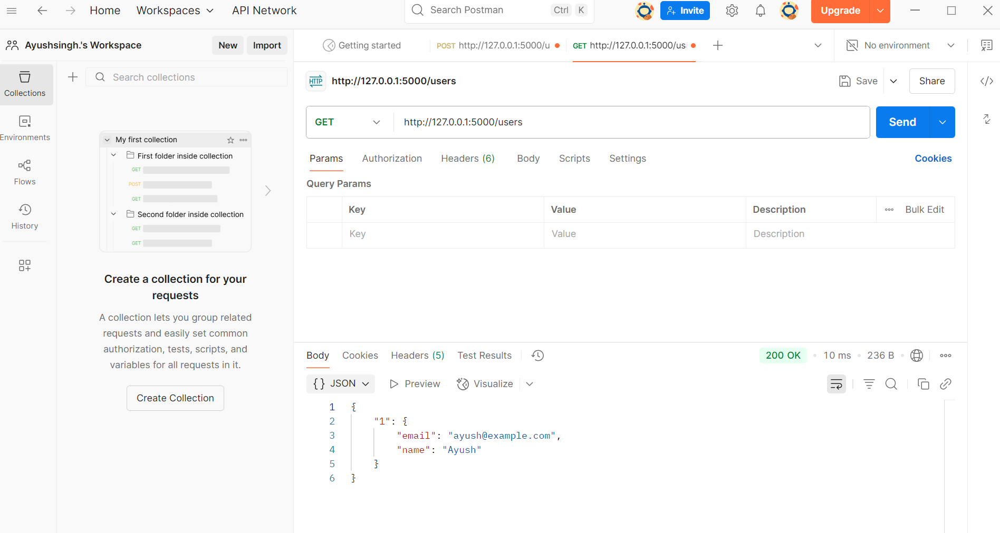
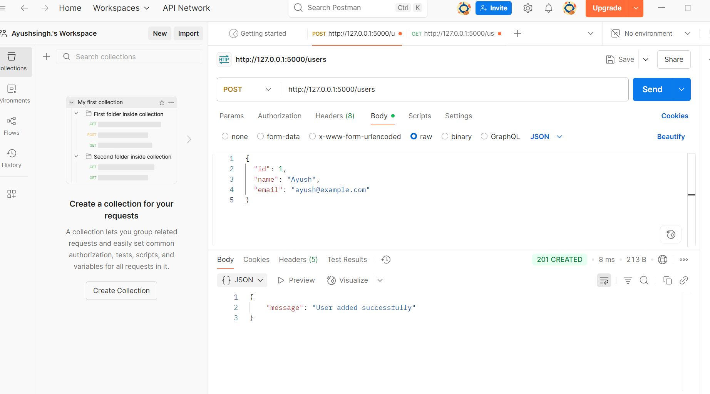
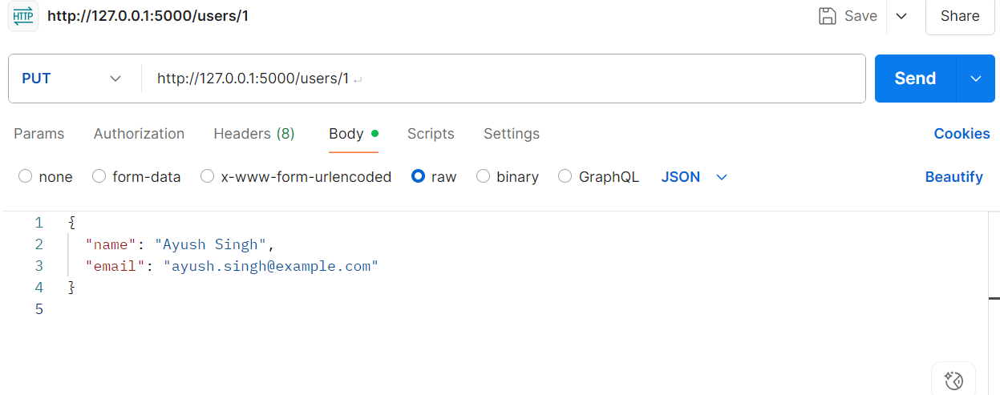
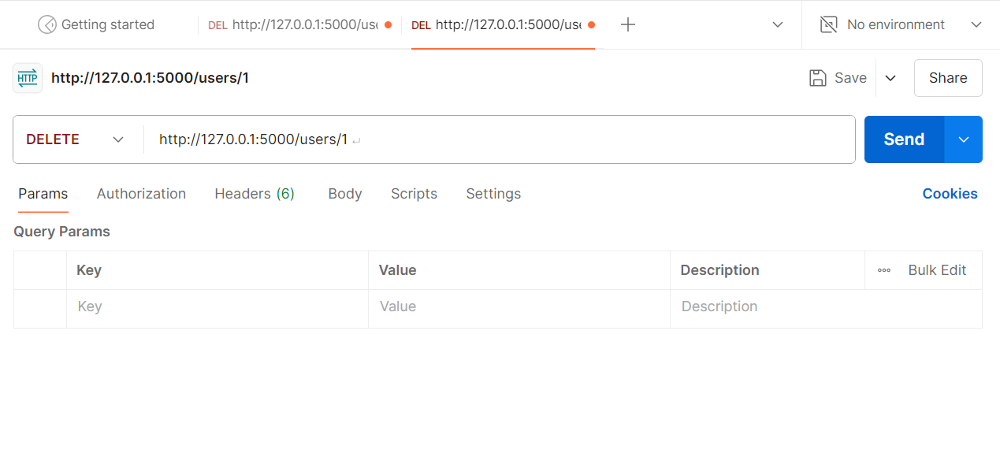

#  Task 4 – REST API with Flask

This project is part of my Python internship with **BroskiesHub**.  
It is a simple REST API built using Flask to manage user data.

##  Features
- Add a new user (POST)
- Get all users / specific user (GET)
- Update a user’s info (PUT)
- Delete a user (DELETE)

##  Tools & Concepts Used
- Flask framework
- REST API methods (GET, POST, PUT, DELETE)
- Python dictionary for temporary data storage
- JSON requests and responses

## ▶ How to Run
1. Install Flask using: `pip install flask`
2. Run the app: `python app.py`
3. Use **Postman** or **curl** to test the endpoints

##  Endpoints Example

##  Postman Testing Screenshots

### 🔹 GET /users

### 🔹 POST /users

### 🔹 PUT /users/1

### 🔹 DELETE /users/1

